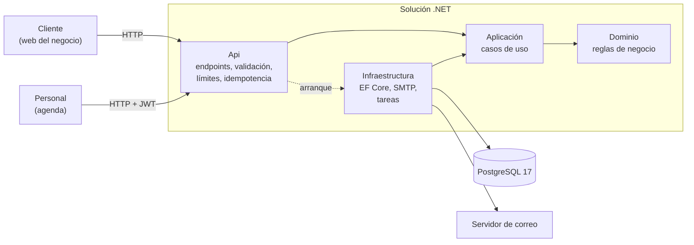
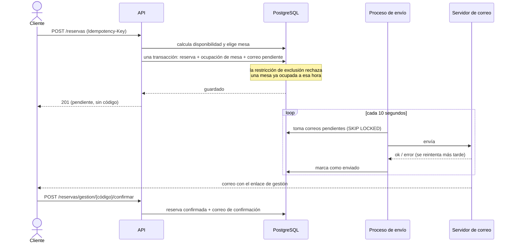
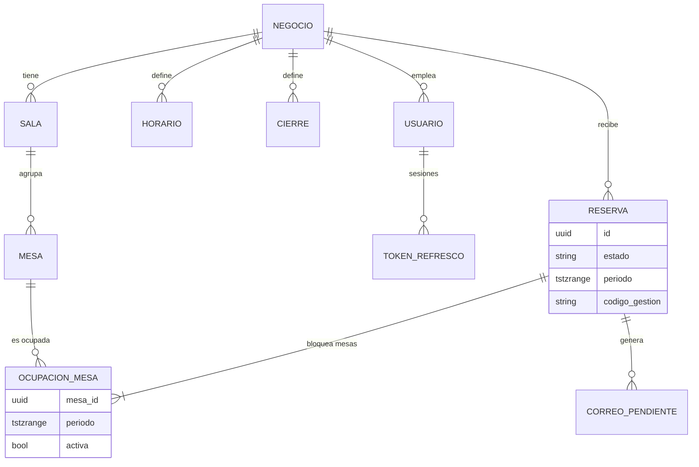

# Reservas API

API de reservas para bares y restaurantes, en .NET 10. Varios negocios en la misma API,
disponibilidad por franjas, reservas con confirmación por correo y gestión del día a día
del servicio.

Está pensada como un proyecto real y no como un ejemplo: las reservas no se solapan aunque
lleguen a la vez, ningún negocio ve los datos de otro, un servidor de correo caído no pierde
reservas ni avisos, y cada decisión importante está explicada en un [registro de decisiones](docs/adr/).

## El problema central

Dos personas no pueden reservar la misma mesa a la misma hora, aunque lleguen a la vez.
La garantía no está solo en el código: la da PostgreSQL con una restricción de exclusión
sobre los intervalos de cada mesa, y un test lanza reservas simultáneas para demostrarlo
([cómo funciona](#no-reservar-dos-veces-la-misma-mesa)).

## Arquitectura

Las dependencias apuntan siempre hacia dentro: el dominio no conoce ningún framework, y un proyecto
de tests de arquitectura falla si alguien lo rompe.



## Cómo se hace una reserva

El correo no se envía dentro de la petición: se guarda en la misma transacción que la reserva y otro
proceso lo envía con reintentos ([ADR 0006](docs/adr/0006-correos-con-bandeja-de-salida-y-tareas-programadas.md)).



## Modelo de datos



Todas las tablas con datos de un negocio llevan `negocio_id`. La restricción que impide solapar reservas
está en `ocupaciones_mesa`.

## Probar la API

Con el entorno local arrancado (`dotnet run --project src/Reservas.AppHost`) hay un negocio de
demostración, ficticio, en `bar-la-plaza`. El puerto de la API lo indica el panel de Aspire
(por defecto, 5052).

```bash
# 1. Qué horas hay libres el sábado para dos personas
curl "http://localhost:5052/api/v1/negocios/bar-la-plaza/disponibilidad?fecha=2026-10-03&comensales=2"

# 2. Reservar. Idempotency-Key es obligatoria: una clave única por operación
curl -X POST http://localhost:5052/api/v1/negocios/bar-la-plaza/reservas \
  -H "Content-Type: application/json" \
  -H "Idempotency-Key: $(uuidgen)" \
  -d '{"fecha":"2026-10-03","hora":"21:00","comensales":2,"cliente":{"nombre":"Ana Perez","email":"ana@example.com"}}'
# -> 201, con la reserva pendiente. El código llega por correo (en local, en Mailpit: http://localhost:8025)

# 3. Confirmarla (o consultarla, o cancelarla) con el código del enlace del correo
curl -X POST http://localhost:5052/api/v1/reservas/gestion/CODIGO/confirmar
```

| Método y ruta | Qué hace |
|---|---|
| `GET /api/v1/negocios/{slug}` | Datos públicos del negocio |
| `GET /api/v1/negocios/{slug}/disponibilidad?fecha=&comensales=` | Horas libres de un día |
| `POST /api/v1/negocios/{slug}/reservas` | Crea una reserva pendiente (exige `Idempotency-Key`) |
| `GET /api/v1/reservas/gestion/{codigo}` | Consulta una reserva |
| `POST /api/v1/reservas/gestion/{codigo}/confirmar` | La confirma (30 minutos de plazo) |
| `POST /api/v1/reservas/gestion/{codigo}/cancelar` | La cancela y libera la mesa |
| `DELETE /api/v1/reservas/gestion/{codigo}` | Borra los datos personales del cliente (RGPD) |

Los errores son `application/problem+json` con un `code` estable (`reserva.mesa_ocupada`,
`validacion.invalida`, `limite.excedido`…): los clientes deben fijarse en él, no en el texto.
Repetir un `POST` con la misma clave devuelve la misma respuesta sin crear otra reserva
([ADR 0004](docs/adr/0004-idempotencia-de-las-peticiones.md)). El contrato completo está en
`/openapi/v1.json` (en desarrollo) y guardado en el repositorio en
[`openapi.v1.json`](tests/Reservas.Api.Tests/Contrato/openapi.v1.json).

## La parte del personal

El personal del negocio inicia sesión y trabaja con su agenda. En desarrollo hay tres cuentas de
demostración del negocio ficticio, todas con la contraseña `Demo-Reservas-2026`:
`propietario@demo.example`, `encargado@demo.example` y `personal@demo.example`.

```bash
# Iniciar sesión: devuelve un access token (15 minutos) y un token de renovación (un solo uso)
curl -X POST http://localhost:5052/api/v1/auth/login \
  -H "Content-Type: application/json" \
  -d '{"email":"personal@demo.example","contrasena":"Demo-Reservas-2026"}'

# Ver la agenda de un día
curl "http://localhost:5052/api/v1/gestion/agenda?fecha=2026-10-03" -H "Authorization: Bearer $TOKEN"
```

| Rol | Puede |
|---|---|
| **Personal** | Ver la agenda, apuntar reservas, sentar a un grupo, completarlo, darlo por no presentado o cancelar |
| **Encargado** | Además, configurar salas, mesas, horarios y cierres |
| **Propietario** | Además, dar de alta y baja a las personas del negocio |

Cada negocio ve solo lo suyo, y esa garantía la dan dos defensas independientes (un filtro global de
la base de datos y una comprobación en cada caso de uso): con el identificador de algo de otro
negocio se recibe un 404, como si no existiera. Las sesiones, los roles y el aislamiento están
explicados en el [ADR 0005](docs/adr/0005-sesion-del-personal-y-aislamiento-por-negocio.md).

## Correos y tareas programadas

Al reservar por internet, el cliente recibe un correo con el enlace para confirmar (la respuesta de
la API **no** trae el código secreto: solo llega por correo). También recibe la confirmación, el
aviso de cancelación y un recordatorio 24 horas antes. Un servidor de correo caído no pierde
reservas ni avisos.

En local, `dotnet run --project src/Reservas.AppHost` levanta también **Mailpit**: los correos que
envía la API se leen en http://localhost:8025, sin que salga nada a internet.

Cada minuto se caducan las reservas sin confirmar (30 minutos de plazo) y se programan los
recordatorios; cada hora se anonimizan los clientes de reservas de más de 24 meses y se purgan las
tablas que crecen sin parar. El cliente puede pedir que se borren sus datos con
`DELETE /api/v1/reservas/gestion/{codigo}`.

## No reservar dos veces la misma mesa

La garantía no está en el código sino en PostgreSQL: cada mesa de cada reserva es una fila con
su tramo de tiempo, y una **restricción de exclusión** impide que dos filas activas ocupen la
misma mesa con tramos que se solapen. Lo comprueba la base de datos al escribir, así que es
cierto con cualquier número de peticiones simultáneas, aunque alguien se salte la aplicación.

Un test lanza **20 peticiones simultáneas** por la misma mesa y hora: exactamente una tiene
éxito y las otras 19 reciben `reserva.mesa_ocupada`. Otro lanza reservas que se pisan solo en
parte y comprueba que las aceptadas nunca se solapan.

Al probarlo aparecieron interbloqueos entre las peticiones que compiten, y la solución fue
hacerlas hacer cola por mesa. Está explicado, con lo que no funcionó, en el
[ADR 0003](docs/adr/0003-no-solapar-reservas-en-postgresql.md).

## Calidad

- **Tests de verdad, no de mentira:** se ejecutan contra PostgreSQL 17 y Mailpit reales en
  contenedores (Testcontainers), no contra una base de datos en memoria: la garantía de no solapar
  reservas es una restricción de PostgreSQL y una base falsa no la tendría. Las reglas que más
  importan se han comprobado rompiéndolas a propósito para ver que algún test falla.
- **Arquitectura comprobada:** un proyecto de tests verifica la dirección de las dependencias entre
  capas y otras reglas de diseño (los endpoints no llegan a la base de datos, el dominio no expone
  setters ni define excepciones…). Si alguien las rompe, falla la compilación de los tests.
- **Contrato de la API versionado:** el OpenAPI está guardado en el repositorio y un test lo compara
  con el que publica la API. Cualquier cambio de rutas o respuestas es visible en una revisión y no
  se cuela por accidente.
- **Seguridad:** CodeQL con el conjunto `security-extended`, revisión de paquetes vulnerables y en
  desuso en cada cambio, Dependabot, y un test que recorre todas las rutas y falla si una de la parte
  privada no exige sesión o si una que escribe no tiene límite de peticiones.
- **Producción segura por defecto:** fuera de desarrollo la API no arranca sin clave para firmar
  los tokens, sin contraseña de demostración propia o con un origen CORS mal escrito; no publica su
  contrato y envía cabeceras de seguridad ([ADR 0007](docs/adr/0007-despliegue-de-la-demo.md)).
- **Avisos como errores** y formato comprobado en la integración continua.

## Decisiones

Cada decisión con consecuencias está en [`docs/adr`](docs/adr/) con su contexto, las alternativas
descartadas y lo que se pierde al elegir.

| | Decisión |
|---|---|
| [0001](docs/adr/0001-resultado-en-lugar-de-excepciones.md) | Errores de negocio con `Resultado`, sin excepciones |
| [0002](docs/adr/0002-tiempo-utc-y-hora-local.md) | Instantes en UTC, horarios en hora local y una única conversión |
| [0003](docs/adr/0003-no-solapar-reservas-en-postgresql.md) | No solapar reservas: restricción de exclusión y cola por mesa |
| [0004](docs/adr/0004-idempotencia-de-las-peticiones.md) | Idempotencia de las peticiones con `Idempotency-Key` |
| [0005](docs/adr/0005-sesion-del-personal-y-aislamiento-por-negocio.md) | Sesión del personal y aislamiento entre negocios |
| [0006](docs/adr/0006-correos-con-bandeja-de-salida-y-tareas-programadas.md) | Correos con bandeja de salida y tareas programadas |
| [0007](docs/adr/0007-despliegue-de-la-demo.md) | Despliegue de la demo |

## Demo y despliegue

La API se despliega como una imagen de Docker (`Dockerfile`). El repositorio incluye el plano para
[Render](https://render.com) con la base de datos en [Neon](https://neon.tech)
(`render.yaml`) y una guía paso a paso con todas las variables en [`docs/despliegue.md`](docs/despliegue.md).
La demo usa un negocio, unas cuentas y unas reservas ficticios.

## Stack

.NET 10 · ASP.NET Core (minimal APIs) · EF Core · PostgreSQL 17 · .NET Aspire · OpenTelemetry ·
FluentValidation · MailKit · xUnit v3 · Testcontainers (PostgreSQL y Mailpit reales en los tests)

## Cómo ejecutarlo

Requiere el SDK de .NET 10 y Docker.

```bash
dotnet run --project src/Reservas.AppHost           # PostgreSQL + Mailpit + API, con el panel de Aspire
dotnet run --project tests/Reservas.Dominio.Tests   # tests de un proyecto (los de integración piden Docker)
```

Cada proyecto de `tests/` es un ejecutable. La integración continua los ejecuta uno a uno; para
lanzar todos en local:

```bash
for proyecto in tests/*.Tests/; do dotnet run --project "$proyecto" || break; done
```

## Estructura

```
src/
  Reservas.Dominio/          entidades y reglas de negocio, sin dependencias
  Reservas.Aplicacion/       casos de uso
  Reservas.Infraestructura/  EF Core, correo, bandeja de salida
  Reservas.Api/              endpoints HTTP, seguridad, tareas en segundo plano
  Reservas.AppHost/          entorno local con .NET Aspire
  Reservas.ServiceDefaults/  observabilidad, health checks y resiliencia
tests/                       dominio, aplicación, infraestructura, API y arquitectura
docs/                        decisiones de diseño y guía de despliegue
```

## Licencia

[MIT](LICENSE)
